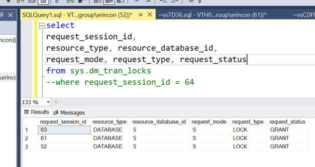
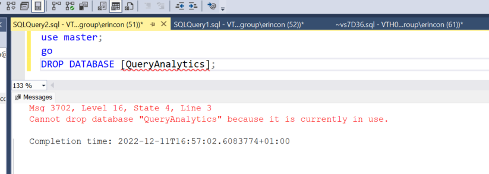

- [Ejercicio](#ejercicio)
- [Solución](#solución)


# Ejercicio

>Este es un ejercicio curioso - quizás poco práctico - para conocer los fundamentos de bloqueos en SQL Server.

¿Por qué para  cada conexión establecida en SQL Server aparece un bloqueo compartido (S) sobre el tipo de recurso (resource_type = DATABASE)?


```
select 
request_session_id, 
resource_type, resource_database_id, 
request_mode, request_type, request_status
from sys.dm_tran_locks
where request_session_id = 64; -- CAMBIA POR TU SESSION_ID
```




# Solución

Abre una conexión nueva con SSMS (Ctrl + N); asegurate que la otra conexión permanece abierta contra la misma base de datos!

Ahora ejecuta el comando DROP DATABASE <nombre_de_BBDD>.

Verás como tras varios segundos, la operación mostrará un mensaje de error como este:



Si durante el intento de borrado, has sido rápido para ejecutar esta consulta:

```
select 
request_session_id, 
resource_type, resource_database_id, 
request_mode, request_type, request_status
from sys.dm_tran_locks
```

podrás ver que la conexión que intenta hacer el borrado, tendrá:
- request_status = WAIT.
- request_mode = X (exclusivo).
- fijate que la otra conexión tiene request_mode = S (Compartido).

y ejecutando esta consulta:

```
SELECT 
	blocked.session_id blocked_session_id, 
	blocker.session_id blocker_session_id, 
	sql_blocker.text blocker_query_text,
	sql_blocked.text blocked_query_text,	req.command,
	req.status, 
	req.start_time,
	req.wait_resource,
	req.wait_time,
	req.wait_resource
FROM    sys.dm_exec_requests req
JOIN    sys.dm_exec_sessions blocked
ON      req.session_id = blocked.session_id
JOIN    sys.dm_exec_sessions blocker
ON      req.blocking_session_id = blocker.session_id
OUTER APPLY sys.dm_exec_sql_text(req.sql_handle) sql_blocked
JOIN    sys.dm_exec_connections c
ON      blocker.session_id = c.session_id
OUTER APPLY sys.dm_exec_sql_text(c.most_recent_sql_handle) sql_blocker
```

Podrás ver que la sesión bloqueada, tendrá estas columnas:
- blocker_query_text: <la última SELECT que ejecutó la conexión abierta>
- blocked_query_text: DROP DATABASE <tu_BBDD>
- Command: DROP DATABASE.
- Status: Suspended.
- Wait_resource: DATABASE: 5:0

¿Qué quiere decir esto? la conexión que quiere hacer el borrado de la BBDD, no puede hacerlo, porque está solicitando un bloqueo X (exclusivo) sobre el recurso DATABASE, y que el motor no se lo puede conceder porque hay otra conexión con un bloqueto tipo S (compartido).

Como sabes, cuando quieres borrar una BBDD en SQL Server, es necesario que nadie tenga una conexión abierta contra la BBDD. El borrado necesita un bloqueo exclusivo contra la BBDD, cosa que no es compatible como ves arriba.

