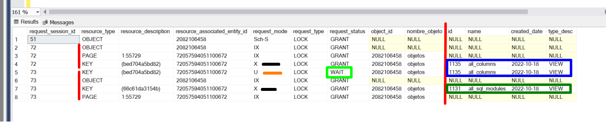
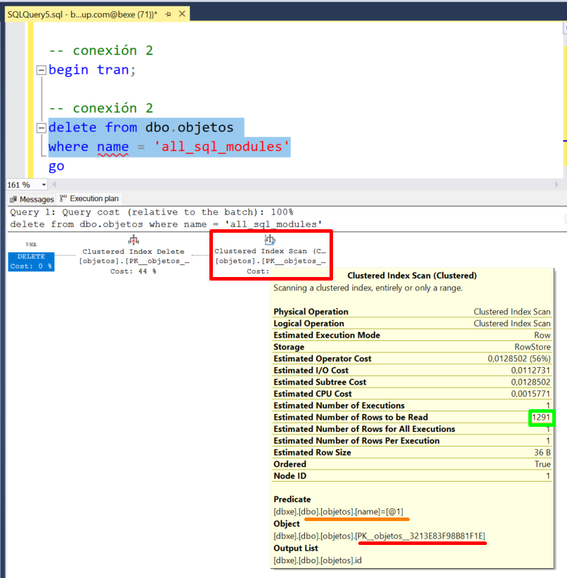
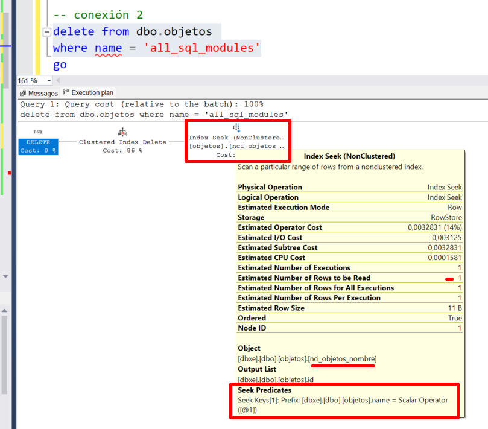
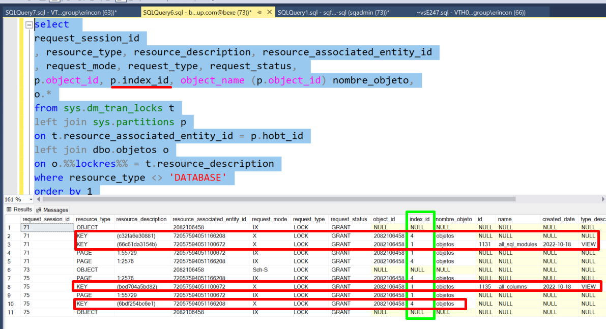

- [Ejercicio](#ejercicio)


# Ejercicio

En este ejercicio vas a ver:
- Qué sucede cuando se borra un registro de una tabla.
- Qué sucede cuando otra conexión intenta borrar otro registro diferente.
- Cómo decodificar los registros bloqueados.
- Analizar su correspondiente plan de ejecución.
- Solucionar el problema para fomentar la concurrencia.

Esta es la tabla con la que vamos a "jugar":

```
if exists (select * from sys.objects where name = 'objetos')
	drop table dbo.objetos;
go

create table dbo.objetos ( 
    id int identity primary key,
    name varchar(100),
	created_date date,
	type_desc varchar(100),
);
go

insert into dbo.objetos (
	name, created_date, type_desc
)
select 
	name, create_date, type_desc
from sys.all_objects;

```
Si ejecutas esta consulta, verás un poco la distribución de registros que tiene la tabla.


```
select top 100 *
from dbo.objetos
order by name asc
```

Las pruebas que vas a hacer necesitan de 2 conexiones (cada una su operación), y otra conexión a modo "auditor". Para facilitar el estudio, abre 3 conexiones y alinealas en formato vertical (en SSMS, menún Windows, opción "New Vertical Tab Group").

En la conexión 1, ejecuta esto:

```
-- conexión 1
begin tran;
go

-- conexión 1
delete from dbo.objetos
where name = 'all_columns';
```

Te mostrará un mensaje como este:

    (1 row affected)
    Completion time: 2022-12-20T21:27:41.5852544+01:00


En la conexión 1, ejecuta esto:

```
-- conexión 2
begin tran;

-- conexión 2
delete from dbo.objetos
where name = 'all_sql_modules';
```

Verás como en esta segunda ejecución, la instrucción no finaliza, y se queda bloqueado.
Fijate en la barra de iconos de SSMS, tienes la opción de parar la ejecución (STOP en color rojo). No lo pulses!

En la tercera conexión ejecuta esta consulta:

```
select 
request_session_id
, resource_type, resource_description, resource_associated_entity_id
, request_mode, request_type, request_status, 
p.object_id, object_name (p.object_id) nombre_objeto,
o.*
from sys.dm_tran_locks t
left join sys.partitions p
on t.resource_associated_entity_id = p.hobt_id
left join dbo.objetos o
on o.%%lockres%% = t.resource_description
where resource_type <> 'DATABASE'
order by 1
```

Donde verás un resultado como este, que vamos a analizar:


- La columna %%lockres%% no es habitual utilizarla (no está documentada): Devuelve el hash de la ubicación física del registro de la tabla. Resulta útil haciendo JOIN con resource_description, cuando la columna resource_type es del tipo KEY. 
- El request_session_id = 72, corresponde a la primera conexión.
- El request_session_id = 73, corresponde a la segunda conexión.
- La sesión 72 para hacer el borrado (name = 'all_columns') ha bloqueado:
  - La PAGE 55729 en modo IX.
  - La KEY (bed704a5bd82) en modo exclusivo (X) para ejecutar el DELETE (1 registro corresponde con name = 'all_columns'.
- La sesión 73 para hacer el borrado (name = 'all_sql_modules') ha bloqueado:
  - La PAGE 55729 en modo IX.
  - La KEY (66c61da3154b) EN modo exclusivo (X) para para ejecutar el DELETE (1 registro corresponde con name = 'all_sql_modules'.
  - Intenta  la KEY (bed704a5bd82) en modo update (U) para ejecutar el DELETE (1 registro corresponde con name = 'all_columns'. INTENTA porque request_status = WAIT. Es decir, no ha podido adquirir el bloque correspondiente.


Te preguntarás por qué la conexión 73 intenta bloquear la KEY (bed704a5bd82) en modo update sobre el registro de la fila cuyo name = 'all_column'. Esta es la duda FUNDAMENTAL de este bloqueo. Si sabes responderla, es probable que este ejercio no esté a la altura de tus conocimientos. La respuesta está en el plan de ejecución de la consulta; para saber más sobre planes de ejecución, revisa la sección correspondiente.

Para la consulta del segundo borrado (la que está bloqueada), marca el texto del DELETE, y pulsa la combinación de teclas (CTRL + L) que te muestra el plan de ejecución estimado. Verás algo como lo que muestra la imagen siguiente:



Donde podrás ver lo siguiente:
- SQL Server recorre el índice clustered de la tabla objetos (PK_objetos....)
- Ese resultado, se lo devuelve al suguiente operador, que hace el borrado (Clustered Index Delete)

Dicho de otro modo, para borrar los registros que cumplen el predicado (name = 'all_sql_modules'), SQL Server necesita recorrerse el índice clusteres de forma completa. Como para recorrer el índice completo, necesita "pasar" por KEYs que están bloqueadas como hemos visto antes, como no puede pasar, tiene que esperar. La razón por la que no puede "pasar" es porque el borrado de la primera conexión no ha finalizado, y al tener un bloqueo exclusivo (X) sobre una KEY por la que necesita "pasar" la segunda conexión, le toca esperar.

Además de ello, aprovechando que estamos tratando temas de índices razonemos un poco más sobre el índice clustered que tiene la tabla: El índice clustered se utiliza para la clave primaria. Ese índice, está ordenado por la columna que forma la clave, en este caso la columna Id de la tabla (incremental IDENTITY).

Pensando en el caso del DELETE en cuestión, el indice, no es eficiente para cumplir el precicado (name = 'valor'). Crea un índice por la columna name, y revisa el plan de ejecución que utilizaría la consulta. Antes de crear el índice, debe hacer ROLLBACK del borrado de la primera conexión (utiliza la instrucción ROLLBACK en la primera conexión).

Este es el script para crear en índice por la columna name:

```
create nonclustered index 
nci_objetos_name
on dbo.objetos (name);
```


Fíjate ahora como el operador ha cambiado (Index Seek), que recorre un rango concreto del índice.
El rango que recorre, viene determinado por la parte marcada en rojo abajo (Seek Predicates), donde verás que corresponde a la búsqueda (name = 'all_sql_modules').

Ejecuta ahora las dos consultas en sus conexiones con sus correspondiente BEGIN TRAN (no hagas COMMIT todavía), y verás que sorpresa! Cada conexión tiene bloqueo exclusivo (X) sobre el registro que quiere borrar.

Fijate en la siguiente captura:


He añadido la columnas index_id a la consulta de arriba, y fíjate que el borrado de cada conexión, además del registro con los datos (filas 3, y 8 de la tabla), necesita borrar registros del índice que hemos creado (filas 2 y 10).

Si has llegado hasta aquí, es una maravilla, habrás entendido/aprendido:
- Cómo los índices bloquean consultas.
- Cómo revisar un plan de ejecución (introducción).
- Cómo revisar qué está bloqueando cada conexión.
- Una columna no documentada de SQL Server :)
- Quizás lo más importante: cómo la creación de un índice resuelve problemas de bloqueos.
- Tener índices implica bloquear más registros, por lo que crealos con tino.

Referencias:

- ScaryDBA: [Columna no documentada: %%LOCKRES%](https://www.scarydba.com/2010/03/18/undocumented-virtual-column-lockres/)
